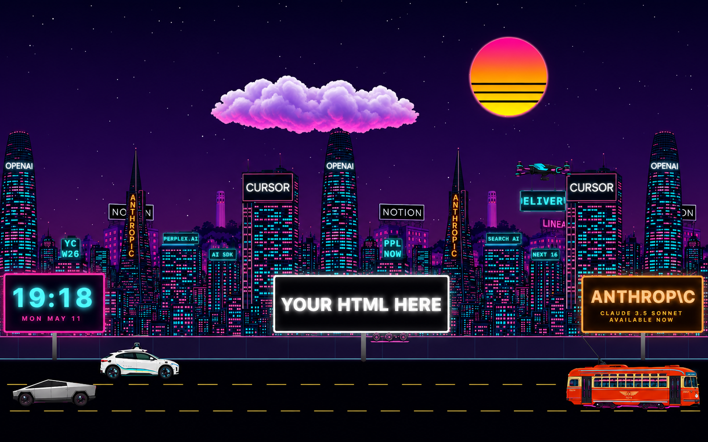

# roku-sf

A browser-based screensaver inspired by [Roku City](https://en.wikipedia.org/wiki/Roku#Roku_City), reimagined as 1980s-synthwave San Francisco. Layered parallax skyline of SF landmarks, neon perspective road, autonomous vehicles with spinning wheels, sidewalk delivery bots, a hovering drone, and dynamic HTML billboards advertising real AI startups.

Runs in any browser. No build step, no npm dependencies, no framework.


<!-- Replace docs/preview.png with a real screenshot/gif. -->

## Run

```bash
git clone https://github.com/YOUR-USERNAME/roku-sf.git
cd roku-sf
python3 -m http.server 8088
# or:  npm run dev
```

Open <http://localhost:8088>.

## What's in it

- **3-layer parallax skyline**: distant Bay Bridge silhouette, mid-distance Painted Ladies + Coit Tower, foreground Salesforce Tower + Transamerica Pyramid + Cursor billboard
- **Side-view street** with a dark purple sidewalk, neon curb edges, 3 dashed lanes of asphalt
- **Vehicles with spinning wheel overlays**: Waymo robotaxi, Tesla Cybertruck, F-Market streetcar
- **Sidewalk delivery bot** with a tablet-screen face that displays live HTML
- **Cursor blimp** drifting overhead
- **Quadcopter drone** with a dangling LED display
- **Synthwave sunset** with twinkling stars, Karl-the-Fog clouds, and a retro scanline sun
- **Three HTML billboards** on the sidewalk that parallax-scroll past — one shows a live clock, others are styled ad placeholders ready for arbitrary HTML
- **Dynamic logo slots** baked onto skyline buildings: as a tile scrolls off-screen, its ad picks new content from a rotation. The same building re-entering from the right will likely show a different ad.

## Calibration tools (in-browser)

Press a key while the screensaver is running to enter a tracing mode. Each mode pauses the world, snaps relevant sprites into evenly-spaced positions, and lets you drag rectangles or wheels with the mouse. Press `C` while in any mode to copy the current values to your clipboard — ready to paste back into `src/main.js`.

| Key | Mode | Purpose |
| --- | --- | --- |
| `B` | Building-logo trace | Draw rectangles on the leftmost skyline-near tile to define `LOGO_SLOTS` regions in source-image coordinates. Auto-normalizes `xFrac` into `[0, 1)`. |
| `E` | Entity-screen trace | Draw a rectangle on each entity (delivery bot, streetcar, drone) to define where the HTML display panel sits in bbox coordinates. |
| `D` | Wheel calibration | Drag wheels on the cars and streetcar to fine-tune their `xFrac/yFrac/rFrac` for the spinning-spoke overlay. Scroll on a selected wheel to resize. |

All three modes are mutually exclusive. Press the same key again to exit.

## Regenerating the assets

The PNGs in `assets/` are committed so the project runs out of the box. To regenerate them with your own variations:

```bash
export OPENAI_API_KEY=sk-...
node scripts/generate-assets.mjs            # all assets that don't already exist
node scripts/generate-assets.mjs --force    # regenerate everything
node scripts/generate-assets.mjs --only=blimp,car-1
```

gpt-image-2 doesn't currently support transparent backgrounds, so the prompts ask for a uniform `#00FF00` lime-green where transparency is wanted. The output then gets run through a background remover — [Figma's AI background removal](https://help.figma.com/hc/en-us/articles/24380794476311-Remove-image-backgrounds-using-AI) does a clean job; so does [`@imgly/background-removal-node`](https://github.com/imgly/background-removal-js).

Cost is roughly $0.20–$0.30 per image at high quality, ~$4 for the full set of 13.

## File layout

```
roku-sf/
├── index.html           Single page, no build step
├── style.css            Synthwave palette, billboard styles, calibration panels
├── src/
│   └── main.js          Canvas renderer, sprite system, HTML overlay logic, all 3 trace tools
├── assets/              AI-generated PNGs (committed)
├── scripts/
│   └── generate-assets.mjs   OpenAI gpt-image-2 batch generator
└── package.json
```

## Customizing

Most things you'd want to tweak live in `src/main.js`:

- **Camera speed** — top of file, `CAMERA_SPEED` constant
- **Parallax depths** — the `camera * 0.20 / 0.45 / 0.75` multipliers in `render()` for far / mid / near skylines
- **Lane positions / car speeds** — the `buildSprites()` function
- **Wheel positions** — each vehicle's `wheels` array (use the `D` calibration tool)
- **Logo slot positions** — the `LOGO_SLOTS` array (use the `B` calibration tool)
- **Logo content rotations** — the `SLOT_CONTENTS` map
- **Billboard content** — `index.html` (HTML billboards are static elements; swap in anything: iframe, video, react widget, etc.)

## Trademarks

This is an artistic homage. Brand names that appear in the scene — OpenAI, Anthropic, Cursor, Vercel, Perplexity, Y Combinator, Notion, Linear, Scale AI, Waymo, Tesla, Cybertruck, Model S, Roku, and others — are trademarks of their respective owners. Their inclusion here is parody / fan-art under fair use. No affiliation, sponsorship, or endorsement is implied.

If you're a representative of one of these companies and would prefer your name not appear in this project, open an issue and I'll swap it out.

## License

MIT — see [LICENSE](LICENSE).
